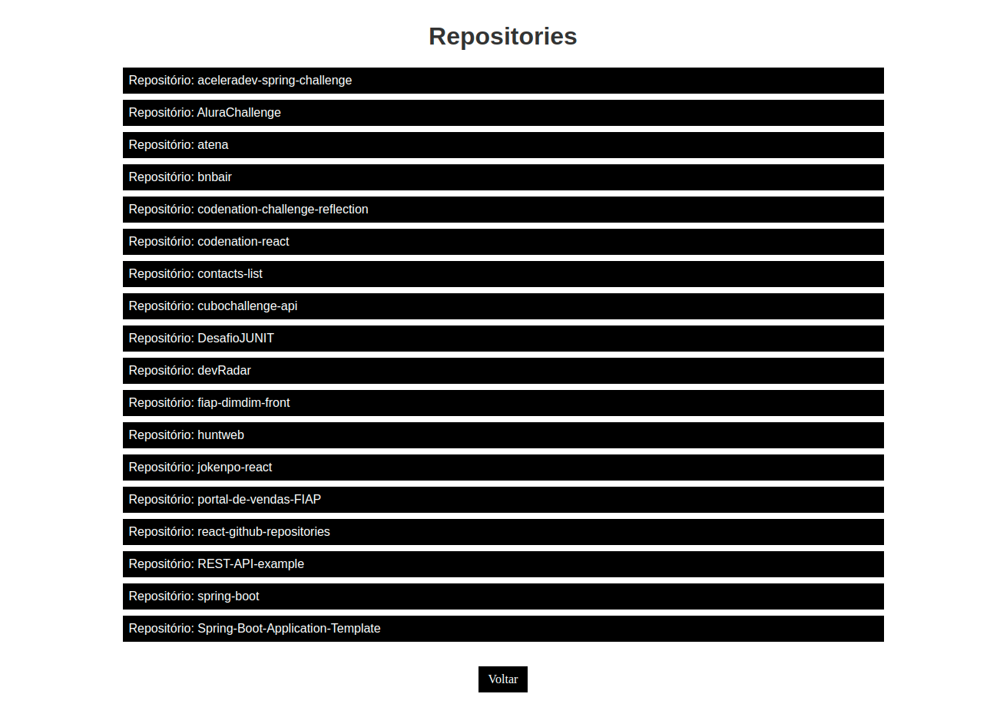

# GitHub Repository

Este projeto foi desenvolvido para listar os repositórios de um usuário pelo seu nome no GitHub.

---

## Tecnologias
 - [React](https://reactjs.org/)
 - GitHub API

---

## Objetivo do projeto
o objetivo do projeto foi melhorar minhas habilidades no conceito de componentização, propriedade, estado, Hooks(useSate, useEffect e useHistory), renderização condicional e criar rotas para a aplicação.

home

repositories